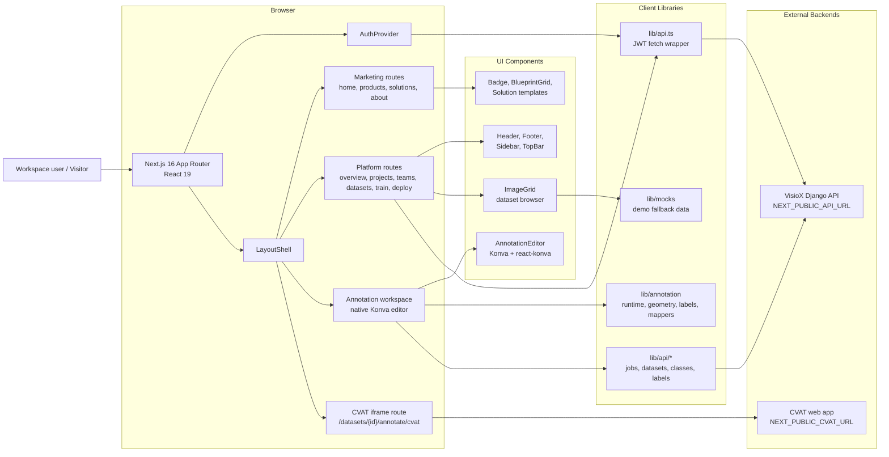
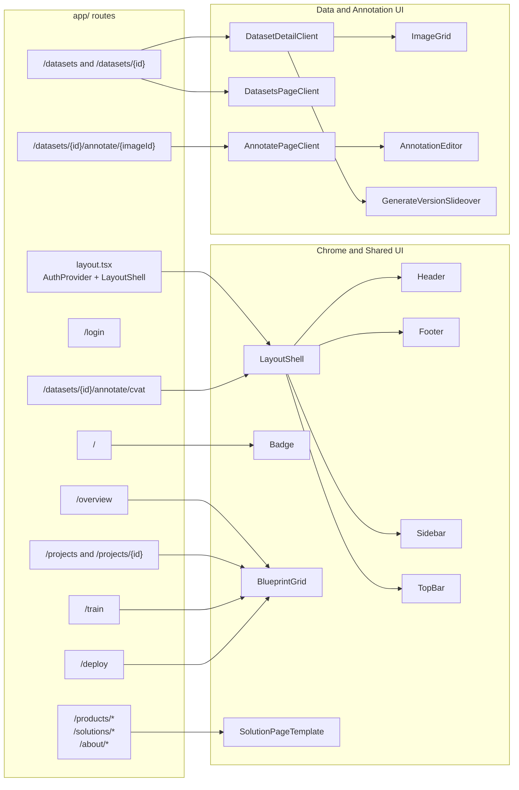
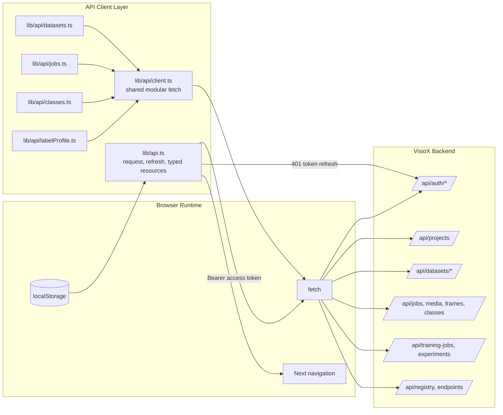
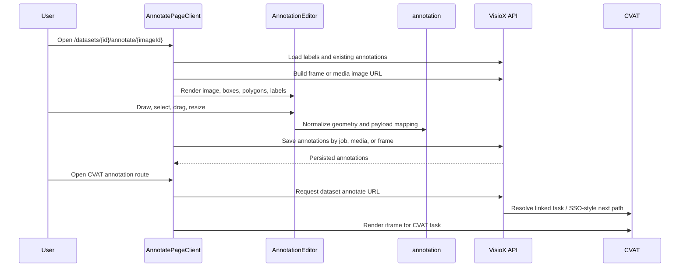
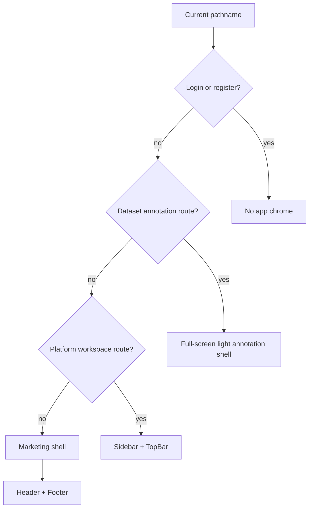

# VisioX UI Source Diagrams

These diagrams were derived from the current `visiox-ui` repository structure and runtime configuration, mainly from:

- `package.json`
- `next.config.mjs`
- `app/layout.tsx`
- `components/LayoutShell.tsx`
- `lib/auth.tsx`
- `lib/api.ts`
- `lib/api/client.ts`
- `lib/api/datasets.ts`
- `lib/api/jobs.ts`
- `lib/annotation/*`
- `components/annotate/AnnotationEditor.tsx`
- `app/datasets/[id]/DatasetDetailClient.tsx`
- `app/datasets/[id]/annotate/[imageId]/AnnotatePageClient.tsx`
- `app/datasets/[id]/annotate/cvat/page.tsx`

They intentionally mirror the style of `cvat/ARCHITECTURE_DIAGRAMS.md`, but describe the VisioX Next.js app as the frontend workspace layered over the VisioX Django API and optional CVAT annotation surfaces.

You can render these blocks directly in GitHub Markdown or in Mermaid Live.

## 1. Architecture Diagram



## 2. Data Flow Diagram

```mermaid
flowchart TD
    User[User]
    UI[Next.js browser UI]
    Auth[AuthProvider and token storage]
    API[VisioX Django API]
    CVAT[CVAT iframe / frame source]

    P1[Process: login, refresh, logout]
    P2[Process: workspace shell and route gating]
    P3[Process: project and dataset browsing]
    P4[Process: upload, delete, version, sync]
    P5[Process: data browser and frame overlay rendering]
    P6[Process: native annotation editor]
    P7[Process: CVAT annotation handoff]
    P8[Process: training and deployment dashboards]

    D1[(localStorage JWT and user)]
    D2[(React component state)]
    D3[(Mock demo data)]

    User --> UI
    UI --> P1
    P1 --> API
    P1 --> D1
    D1 --> Auth

    UI --> P2
    Auth --> P2
    P2 -->|platform route guard| UI

    UI --> P3
    P3 --> API
    P3 --> D2
    D3 --> P3

    UI --> P4
    P4 -->|FormData and JSON requests| API
    P4 --> D2

    UI --> P5
    P5 -->|GET /api/datasets/{id}/browser/| API
    P5 -->|GET /api/datasets/{id}/frames/{frame}/?token=...| API
    P5 --> D2

    UI --> P6
    P6 -->|GET/PATCH /api/jobs/{id}/annotations/| API
    P6 -->|GET/PUT media or frame annotations| API
    P6 --> D2

    UI --> P7
    P7 -->|GET /api/datasets/{id}/annotate_url/| API
    P7 -->|iframe navigation| CVAT

    UI --> P8
    P8 -->|training jobs, experiments, endpoints, registry| API
```

## 3. Frontend Component Diagram



## 4. Client/API Layer Diagram



## 5. Annotation Flow Diagram



## 6. Route Shell Diagram



## Notes

- `LayoutShell` is the route-level composition point. Marketing pages get `Header` and `Footer`, platform pages get `Sidebar` and `TopBar`, auth pages get no chrome, and annotation routes get a full-screen workspace without the platform shell.
- `lib/api.ts` is the main typed client and owns JWT storage, refresh-on-401, and browser-host URL normalization. `lib/api/*` contains smaller annotation-focused helpers used by the editor.
- `lib/annotation` is the unified annotation module. It now holds shared types, geometry helpers, object state, history, session management, and API mappers in one place.
- Native annotation is implemented in VisioX with `konva` and `react-konva`; CVAT remains available as an embedded task workflow through the dataset CVAT route.
- Static export is configured through `next.config.mjs`, so dynamic App Router pages use static params/client wrappers where needed.
