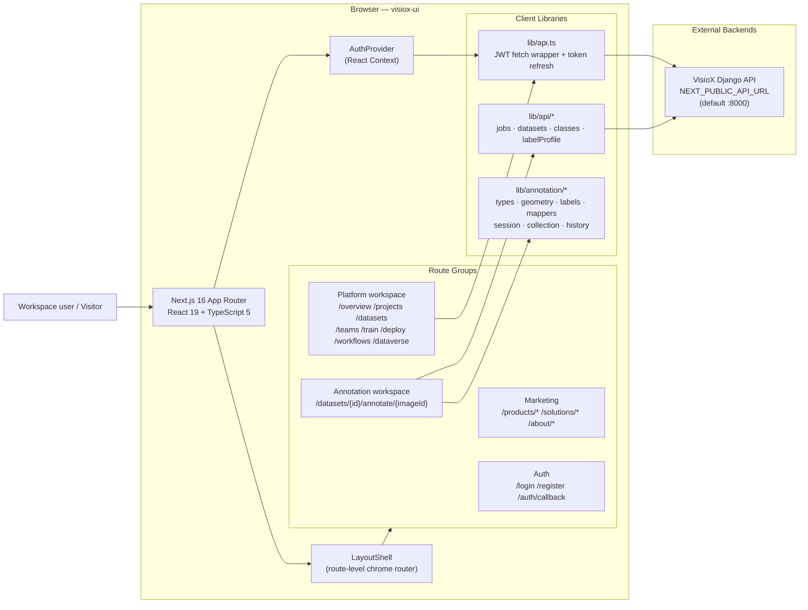
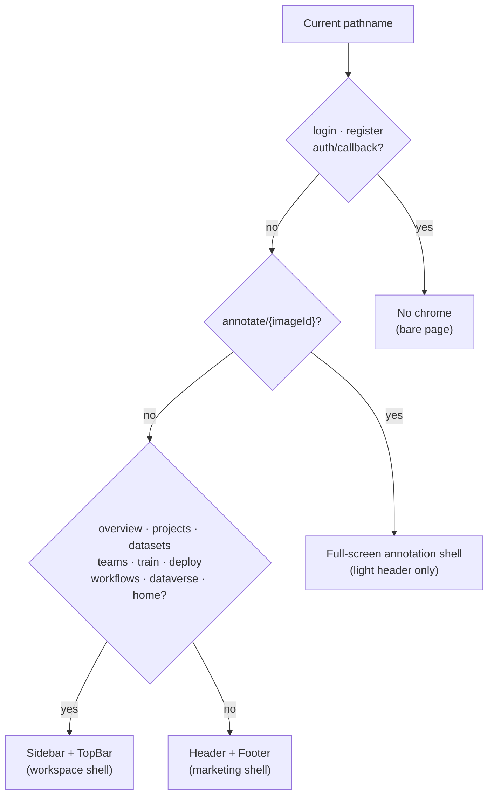
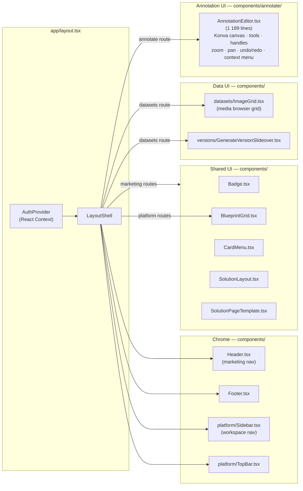
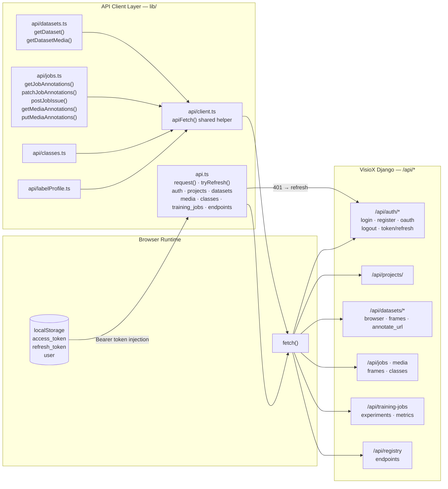
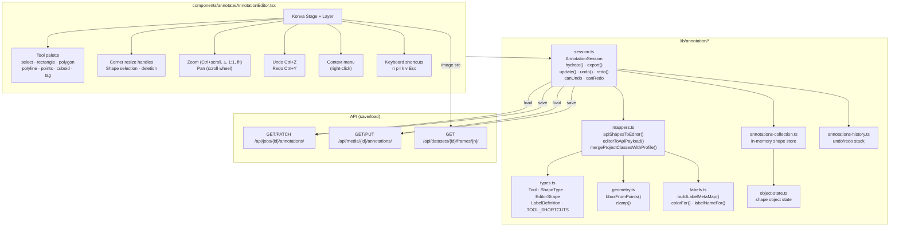
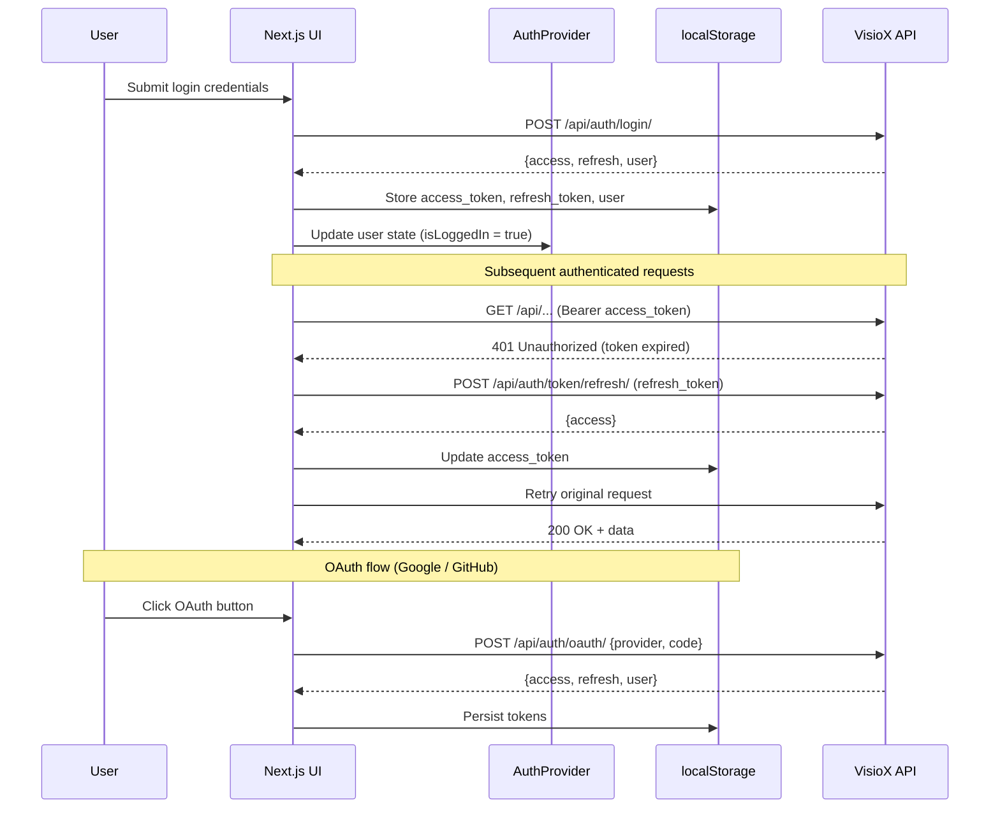
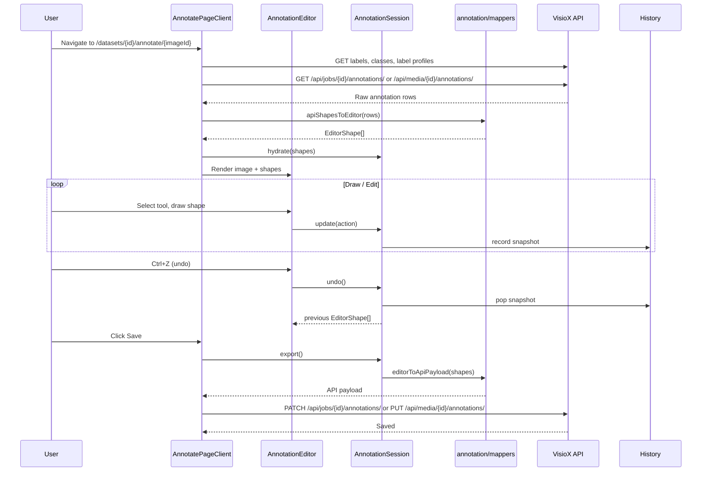
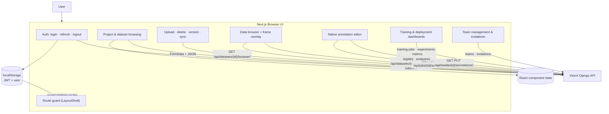

# VisioX UI — Architecture Diagrams

Derived from the current `visiox-ui` repository (Next.js 16, React 19, App Router).

Source files referenced:
- `package.json`, `next.config.mjs`, `tsconfig.json`
- `app/layout.tsx`, `components/LayoutShell.tsx`
- `lib/auth.tsx`, `lib/api.ts`, `lib/api/client.ts`
- `lib/api/{datasets,jobs,classes,labelProfile}.ts`
- `lib/annotation/{types,geometry,labels,mappers,session,object-state,annotations-collection,annotations-history}.ts`
- `components/annotate/AnnotationEditor.tsx`
- `app/datasets/[id]/DatasetDetailClient.tsx`
- `app/datasets/[id]/annotate/[imageId]/AnnotatePageClient.tsx`

Render these blocks in GitHub Markdown or [Mermaid Live](https://mermaid.live).

---

## 1. System Architecture

High-level view of the platform and how the Next.js frontend fits in.

---

## 2. Route Structure & Shell Logic

### Route Inventory

| Route Group | Paths | Shell |
|---|---|---|
| **Auth** | `/login` `/register` `/auth/callback` `/invite/[token]` | Bare |
| **Marketing — Landing** | `/` | Header + Footer |
| **Marketing — Products** | `/products` `/products/annotation` `/products/datahub` `/products/deploy` `/products/model-train` `/products/workflows` | Header + Footer |
| **Marketing — Solutions** | `/solutions` `/solutions/healthcare-medical` `/solutions/manufacturing-industrial` `/solutions/robotics-automation` `/solutions/surveillance-security` `/solutions/transportation-smart-cities` `/solutions/logistics-warehousing` `/solutions/retail-commerce` `/solutions/smart-agriculture` `/solutions/entertainment-sports` | Header + Footer |
| **Marketing — About** | `/about` `/about/company` `/about/blog` `/about/contact` | Header + Footer |
| **Platform** | `/home` `/overview` `/projects` `/projects/new` `/projects/[id]` `/datasets/[id]` `/teams` `/teams/new` `/train` `/deploy` `/workflows` `/dataverse` | Sidebar + TopBar |
| **Annotation (native)** | `/datasets/[id]/annotate/[imageId]` | Full-screen annotation shell |

---

## 3. Component Tree

---

## 4. Client / API Layer

---

## 5. Annotation System Architecture

---

## 6. Authentication & Token Flow

---

## 7. Annotation Workflow

---

## 8. Data Flow Diagram

---

## Notes

- **LayoutShell** (`components/LayoutShell.tsx`) is the single composition point for all page chrome. It inspects `pathname` at render time and injects the appropriate shell (bare, annotation, platform, or marketing).
- **`lib/api.ts`** owns JWT storage, auto-refresh-on-401, and LAN hostname normalization (replaces `localhost` with `window.location.hostname` so the browser can reach the API when accessed from another device on the same network).
- **`lib/annotation/`** is the unified annotation runtime. It exposes a clean public API via `index.ts` and keeps all canvas-independent logic (geometry, label utilities, API mapping, session management, undo/redo) separate from the Konva component.
- **Static export**: Dynamic App Router routes use client wrappers and static params. Base path is set dynamically via the `GITHUB_REPOSITORY` environment variable for GitHub Pages deployment.
