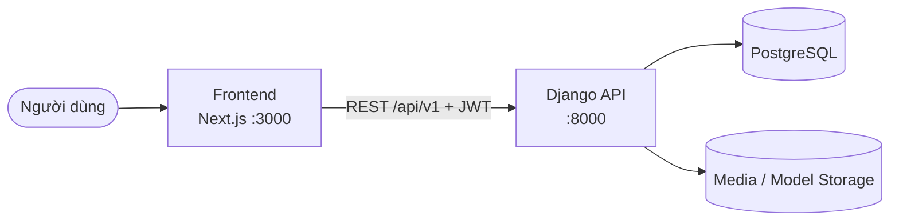
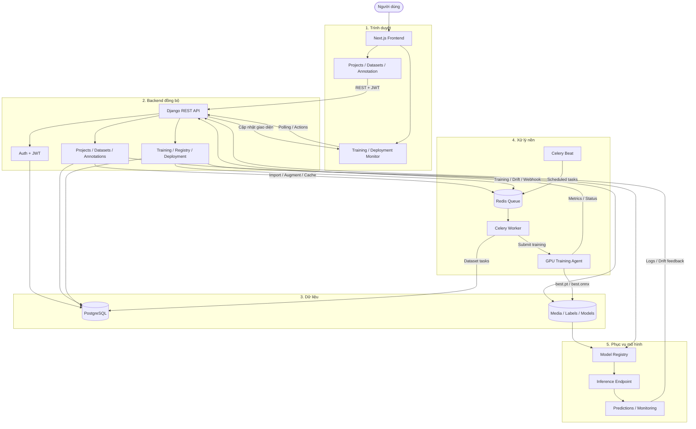
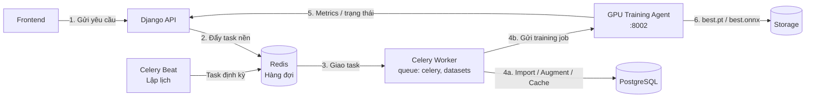
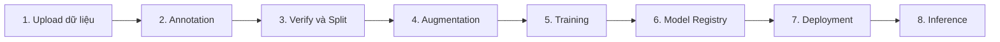
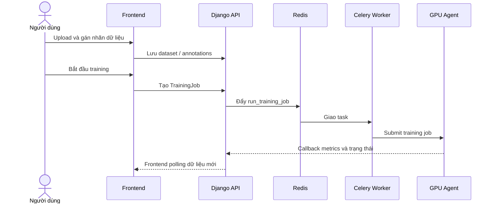
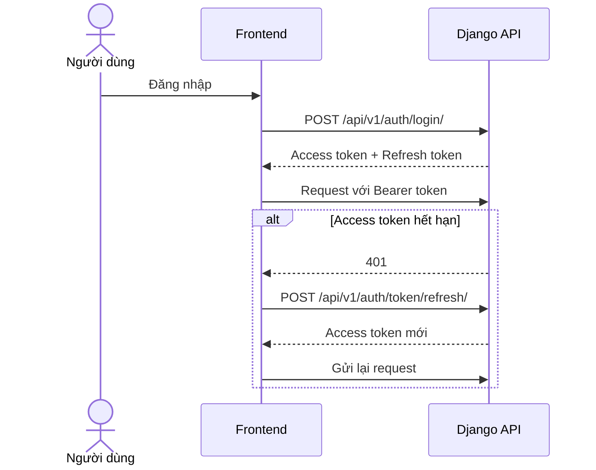

# Tổng quan hệ thống VisioX

## 1. Luồng chính

Đây là luồng dễ nhớ nhất của toàn hệ thống:

- Frontend chỉ giao tiếp với Django API.
- Django API đọc/ghi dữ liệu trong PostgreSQL và Storage.
- Tác vụ nhanh được xử lý ngay trong request; tác vụ lâu được chuyển sang Celery.

## 2. Luồng tổng thể end-to-end

Luồng trên được chia thành năm tầng:

1. Người dùng thao tác trên frontend.
2. Django API xác thực và xử lý nghiệp vụ đồng bộ.
3. PostgreSQL lưu metadata; Storage lưu media, labels và model artifacts.
4. Công việc dài được chuyển qua Redis cho Celery; training được Celery điều phối sang GPU Agent.
5. Model hoàn tất được đăng ký, triển khai thành inference endpoint và gửi monitoring feedback về API.

## 3. Celery nằm ở đâu?

Celery không trực tiếp hiển thị trên frontend và không trực tiếp huấn luyện model. Celery có nhiệm vụ nhận việc nền từ Redis, xử lý tác vụ dataset hoặc điều phối training job sang GPU Training Agent.

| Thành phần | Chạy ở đâu? | Nhiệm vụ |
|---|---|---|
| Django API | Service `api`, cổng `8000` | Nhận request và tạo task nền |
| Redis | Service hạ tầng | Broker và result backend của Celery |
| Celery Worker | Service `worker` | Chạy queue `celery,datasets` |
| Celery Beat | Service `beat` | Tạo task theo lịch |
| GPU Training Agent | Service riêng, cổng `8002` | Huấn luyện model trên GPU |

Các task Celery hiện tại:

- Import dataset.
- Augmentation dataset.
- Build/clear label cache.
- Điều phối training job sang GPU agent.
- Kiểm tra model drift.
- Gửi webhook.

> Khi `USE_CELERY=False`, một số tác vụ dataset chạy bằng background thread. Môi trường production nên dùng `USE_CELERY=True`.

## 4. Luồng nghiệp vụ computer vision

### Upload đến training

## 5. Luồng xác thực

## 6. Cấu hình quan trọng

| Cấu hình | Giá trị / ý nghĩa |
|---|---|
| Frontend | `http://localhost:3000` |
| Django API | `http://localhost:8000` |
| GPU Training Agent | `TRAINING_AGENT_URL`, mặc định cổng `8002` |
| API prefix | `/api/v1/` |
| Celery broker | `CELERY_BROKER_URL` |
| Celery result backend | `CELERY_RESULT_BACKEND` |
| Bật Celery | `USE_CELERY=True` |

## 7. Tóm tắt một câu

> Frontend gọi Django API; Django xử lý việc nhanh, đẩy việc lâu qua Redis cho Celery; Celery xử lý dataset hoặc gửi job sang GPU Agent; kết quả được lưu về Database/Storage và hiển thị lại trên Frontend.
